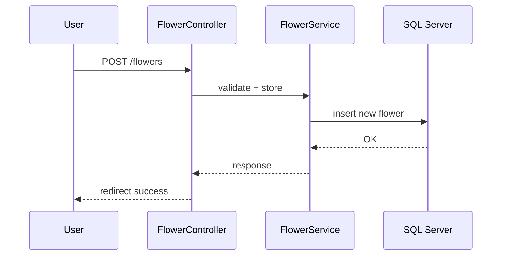

# Flower Inventory Assessment

A Laravel-based web application for managing flower categories and inventory.  
Implements a clean architecture with service layers, CRUD operations, search, sort, pagination, image uploads, and SQL Server integration (via Docker).

---

## Table of Contents

- [Flower Inventory Assessment](#flower-inventory-assessment)
  - [Table of Contents](#table-of-contents)
  - [Features](#features)
  - [Architecture Overview](#architecture-overview)
  - [Requirements](#requirements)
  - [Installation](#installation)
  - [Database Setup](#database-setup)
  - [Running the App](#running-the-app)
  - [Testing](#testing)
  - [Environment Setup](#environment-setup)
  - [SQL Scripts](#sql-scripts)
  - [Project Structure](#project-structure)
  - [Diagrams](#diagrams)
    - [Entity Relationship](#entity-relationship)
    - [Create Flower Sequence](#create-flower-sequence)
  - [Challenges Faced](#challenges-faced)
  - [Notes \& Assumptions](#notes--assumptions)
  - [Future Improvements](#future-improvements)

---

## Features

- CRUD operations for *Categories* and *Flowers*  
- One-to-Many relationship: Category → Flowers  
- Service layer architecture (interfaces, bindings, DI)  
- Search, Sort, Pagination on flower list  
- Validation and Error handling  
- Optional image upload (stored via Laravel’s public disk)  
- Logging using Monolog  
- Seed data (two categories, four flowers)  
- SQL scripts to recreate the database manually  
- Unit test (FlowerServiceTest)  
- Clean Git history and documentation  

---

## Architecture Overview

```mermaid
graph TD
    U[User (Browser)]:::actor
    subgraph L[Laravel App]
      direction LR
      subgraph HTTP[HTTP Layer]
        R[Routes (web.php)]
        MC[Controllers]
        Vw[Blade Views]
        VR[Form Requests]
      end
      subgraph CORE[Core Logic]
        SVC[Service Layer]
        M[Eloquent Models]
        PAG[Search • Sort • Pagination]
        LOG[Logging]
      end
      subgraph IO[Storage]
        FS[(public disk)]
        UP[Image Upload]
      end
    end
    subgraph DB[(SQL Server in Docker)]
      T1[[categories]]
      T2[[flowers]]
    end
    U --> R --> MC --> SVC --> M --> DB
    MC --> Vw
    MC --> FS
    SVC --> LOG
    classDef actor fill:#eef,stroke:#88f,color:#000
```

---

## Requirements

- PHP 8.2+ and Composer  
- Docker (used for SQL Server container)  
- SQL Server drivers for PHP (`pdo_sqlsrv`, `sqlsrv`)  
- Git  
- (Optional) Database client such as Azure Data Studio or DBeaver  

---

## Installation

> The project was developed and tested using Docker for SQL Server.  
> These steps work on Windows, Linux, or macOS.

1. Clone and install:
   ```bash
   git clone <your_repo_url>
   cd flower-inventory
   composer install
   cp .env.example .env
   php artisan key:generate
   ```

2. Run SQL Server in Docker:
   ```bash
   docker run -e "ACCEPT_EULA=Y" -e "MSSQL_SA_PASSWORD=YourStrong!Passw0rd"      -p 1433:1433 --name flowers-sql -d mcr.microsoft.com/mssql/server:2022-latest
   ```

3. Enable SQL Server PHP drivers:
   ```bash
   pecl install sqlsrv
   pecl install pdo_sqlsrv
   ```
   Add to php.ini:
   ```
   extension="sqlsrv"
   extension="pdo_sqlsrv"
   ```

4. Verify installation:
   ```bash
   php -m | grep sqlsrv
   ```

---

## Database Setup

Update `.env`:
```
DB_CONNECTION=sqlsrv
DB_HOST=127.0.0.1
DB_PORT=1433
DB_DATABASE=FlowerShop
DB_USERNAME=sa
DB_PASSWORD=YourStrong!Passw0rd
```

Run:
```bash
php artisan migrate --force
php artisan db:seed --force
```

Or execute the provided SQL scripts.

---

## Running the App

```bash
php artisan serve
```
Then visit: http://127.0.0.1:8000

---

## Testing

```bash
php artisan test
```
Feature tests are located under `tests/Feature/`.

---

## Environment Setup

The `.env` file is excluded for security.  

After cloning:
```bash
cp .env.example .env
php artisan key:generate
```

For Docker setup, the defaults are already valid.

---

## SQL Scripts

Located under `/database/sql/`:

| File | Purpose |
|------|----------|
| 01_create_database.sql | Creates the `FlowerShop` database |
| 02_create_tables.sql | Defines schema for categories and flowers |
| 03_seed.sql | Inserts sample data |

To execute:
```bash
sqlcmd -S 127.0.0.1,1433 -U sa -P 'YourStrong!Passw0rd' -i database/sql/01_create_database.sql
sqlcmd -S 127.0.0.1,1433 -U sa -P 'YourStrong!Passw0rd' -i database/sql/02_create_tables.sql
sqlcmd -S 127.0.0.1,1433 -U sa -P 'YourStrong!Passw0rd' -i database/sql/03_seed.sql
```

---

## Project Structure

```
flower-inventory/
├── app/
│   ├── Http/
│   ├── Models/
│   ├── Services/
│
├── database/
│   ├── migrations/
│   ├── seeders/
│   ├── sql/
│
├── resources/views/
├── tests/Feature/
├── .env.example
├── README.md
```

---

## Diagrams

### Entity Relationship
```mermaid
erDiagram
    CATEGORY ||--o{ FLOWER : has
    CATEGORY {
        int id PK
        string name UNIQUE
    }
    FLOWER {
        int id PK
        int category_id FK
        string name
        string type
        decimal price
        string image_path
    }
```

### Create Flower Sequence


---

## Challenges Faced

1. **SQLSRV Driver Installation on macOS**  
   Installing `sqlsrv` and `pdo_sqlsrv` via PECL repeatedly failed on Apple Silicon due to compilation and permission errors.  
   Fixed by manually compiling the extensions and linking them directly to PHP’s config directory.

2. **SQL Server SSL Certificate Error**  
   Laravel migrations failed with an SSL self-signed certificate error.  
   Solved by updating `config/database.php` and `.env` to trust the Docker container’s self-signed certificate using `trust_server_certificate=true`.

3. **Testing Failures (Missing HasFactory Trait)**  
   Feature tests initially failed with `BadMethodCallException: factory()` errors.  
   Resolved by adding the `HasFactory` trait to models and creating proper factory files for both `Category` and `Flower`.

4. **CSS Not Loading**  
   Pages rendered without styling due to incorrect CSS file paths and Blade syntax.  
   Fixed by moving styles to `/public/css` and correcting the asset reference to `{{ asset('css/style.css') }}`.

5. **Image Upload & Deletion Issues**  
   Encountered several problems including permission errors, missing form encoding, nullable database fields, and improper file deletions.  
   Fixed by using correct form attributes (`multipart/form-data`), ensuring public storage linking, validating optional uploads, and cleaning old files via `Storage::disk('public')->delete()`.

---

## Notes & Assumptions

- `.env` excluded from repository.  
- The Docker password is a placeholder for local use only.  
- SQL Server 2022 container required.  
- Images stored in `storage/app/public/flowers`.  
- Blade uses minimal styling.  
- Logging handled via Laravel’s Monolog.

---

## Future Improvements

- Add authentication (Laravel Breeze)  
- REST API endpoints  
- Tailwind CSS interface  
- Docker Compose setup for full environment  
- Additional tests for filtering and sorting  
- Image optimization and versioning  

---

**Author:** Petros  
**Built with:** Laravel 11, SQL Server, Docker, PHP 8.2, Blade, Eloquent  
**License:** MIT
