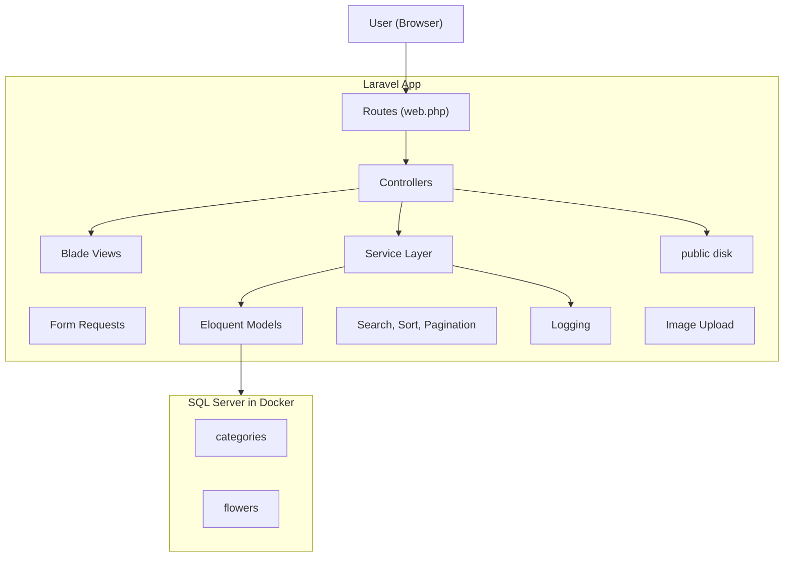
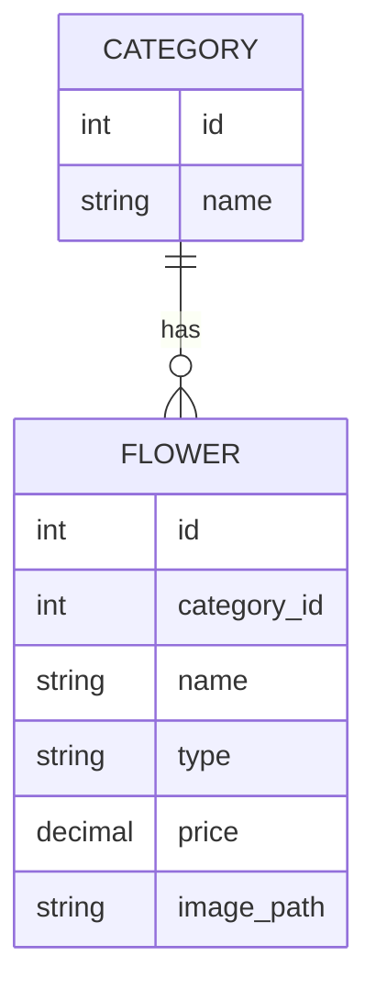
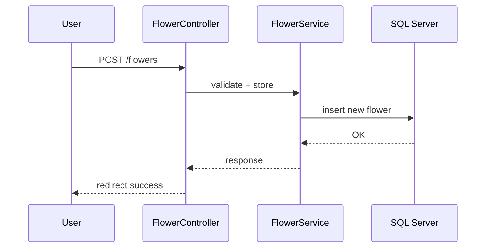

# Flower Inventory Assessment

A Laravel-based web application for managing flower categories and inventory.  
Implements a clean architecture with service layers, CRUD operations, search, sort, pagination, image uploads, and SQL Server integration (via Docker).

---

## Table of Contents

- [Flower Inventory Assessment](#flower-inventory-assessment)
  - [Table of Contents](#table-of-contents)
  - [Features](#features)
  - [Architecture Overview](#architecture-overview)
  - [Requirements](#requirements)
  - [Installation](#installation)
  - [Database Setup](#database-setup)
  - [Running the App](#running-the-app)
  - [Testing](#testing)
  - [Environment Setup](#environment-setup)
  - [SQL Scripts](#sql-scripts)
  - [Project Structure](#project-structure)
  - [Diagrams](#diagrams)
    - [Entity Relationship](#entity-relationship)
    - [Create Flower Sequence](#create-flower-sequence)
  - [Challenges Faced](#challenges-faced)
  - [Notes \& Assumptions](#notes--assumptions)
  - [Future Improvements](#future-improvements)

---

## Features

- CRUD operations for Categories and Flowers
- One-to-Many relationship: Category -> Flowers
- Service layer architecture (interfaces, bindings, DI)
- Search, Sort, Pagination on flower list
- Validation and Error handling
- Optional image upload (stored via Laravel public disk)
- Logging using Monolog
- Seed data (two categories, four flowers)
- SQL scripts to recreate the database manually
- Unit test (FlowerServiceTest)
- Clean Git history and documentation

---

## Architecture Overview



---

## Requirements

- PHP 8.2+ and Composer
- Docker (used for SQL Server container)
- SQL Server drivers for PHP (pdo_sqlsrv, sqlsrv)
- Git
- (Optional) Database client such as Azure Data Studio or DBeaver

---

## Installation

> The project was developed and tested using Docker for SQL Server.  
> These steps work on Windows, Linux, or macOS.

1. Clone and install:
   ```bash
   git clone <your_repo_url>
   cd flower-inventory
   composer install
   cp .env.example .env
   php artisan key:generate
   ```

2. Run SQL Server in Docker:
   ```bash
   docker run -e "ACCEPT_EULA=Y" -e "MSSQL_SA_PASSWORD=YourStrong!Passw0rd"      -p 1433:1433 --name flowers-sql -d mcr.microsoft.com/mssql/server:2022-latest
   ```

3. Enable SQL Server PHP drivers:
   ```bash
   pecl install sqlsrv
   pecl install pdo_sqlsrv
   ```
   Add to php.ini:
   ```
   extension="sqlsrv"
   extension="pdo_sqlsrv"
   ```

4. Verify installation:
   ```bash
   php -m | grep sqlsrv
   ```

---

## Database Setup

Update `.env`:
```
DB_CONNECTION=sqlsrv
DB_HOST=127.0.0.1
DB_PORT=1433
DB_DATABASE=FlowerShop
DB_USERNAME=sa
DB_PASSWORD=YourStrong!Passw0rd
```

Run:
```bash
php artisan migrate --force
php artisan db:seed --force
```

Or execute the provided SQL scripts.

---

## Running the App

```bash
php artisan serve
```
Then visit: http://127.0.0.1:8000

---

## Testing

```bash
php artisan test
```
Feature tests are located under `tests/Feature/`.

---

## Environment Setup

The `.env` file is excluded for security.

After cloning:
```bash
cp .env.example .env
php artisan key:generate
```

For Docker setup, the defaults are already valid.

---

## SQL Scripts

Located under `/database/sql/`:

| File | Purpose |
|------|----------|
| 01_create_database.sql | Creates the FlowerShop database |
| 02_create_tables.sql | Defines schema for categories and flowers |
| 03_seed.sql | Inserts sample data |

To execute:
```bash
sqlcmd -S 127.0.0.1,1433 -U sa -P 'YourStrong!Passw0rd' -i database/sql/01_create_database.sql
sqlcmd -S 127.0.0.1,1433 -U sa -P 'YourStrong!Passw0rd' -i database/sql/02_create_tables.sql
sqlcmd -S 127.0.0.1,1433 -U sa -P 'YourStrong!Passw0rd' -i database/sql/03_seed.sql
```

---

## Project Structure

```
flower-inventory/
├── app/
│   ├── Http/
│   ├── Models/
│   ├── Services/
│
├── database/
│   ├── migrations/
│   ├── seeders/
│   ├── sql/
│
├── resources/views/
├── tests/Feature/
├── .env.example
├── README.md
```

---

## Diagrams

### Entity Relationship


### Create Flower Sequence


---

## Challenges Faced

1. SQLSRV Driver Installation on Apple Silicon (PECL failures)  
   Installing sqlsrv and pdo_sqlsrv via PECL failed due to compilation and permission issues.  
   Fixed by manually compiling both extensions and linking the built .so files via custom conf.d entries.

2. SQL Server SSL Certificate Error  
   Migrations failed due to self-signed certificate rejection (ODBC 18+).  
   Solved by enabling encrypted connections while trusting the server certificate in config/database.php and .env for local development.

3. Testing Failures (Missing HasFactory)  
   Feature tests failed with factory() errors.  
   Resolved by adding HasFactory to models and creating factories for Category and Flower.

4. CSS Not Loading  
   The layout loaded without styles because the CSS was outside public/ and the Blade asset call was invalid.  
   Fixed by moving styles to public/css/ and using {{ asset('css/style.css') }} with cache-busting.

5. Image Upload and Deletion  
   Issues included missing multipart/form-data, permissions, nullable DB field handling, and orphaned files.  
   Fixed via proper validation, php artisan storage:link, and deleting old files with Storage::disk('public')->delete().

---

## Notes & Assumptions

- .env is excluded from the repository.
- The Docker password in examples is a local placeholder only.
- SQL Server 2022 container is required.
- Images are stored in storage/app/public/flowers (served via public/storage symlink).
- Minimal Blade styling.
- Logging via Laravel Monolog.

---

## Future Improvements

- Add authentication (Laravel Breeze)
- Expose REST API endpoints
- Tailwind CSS interface
- Docker Compose for full environment
- Additional tests for filtering and sorting
- Image optimization and versioning

---

Author: Petros  
Built with: Laravel 11, SQL Server, Docker, PHP 8.2, Blade, Eloquent  
License: MIT
